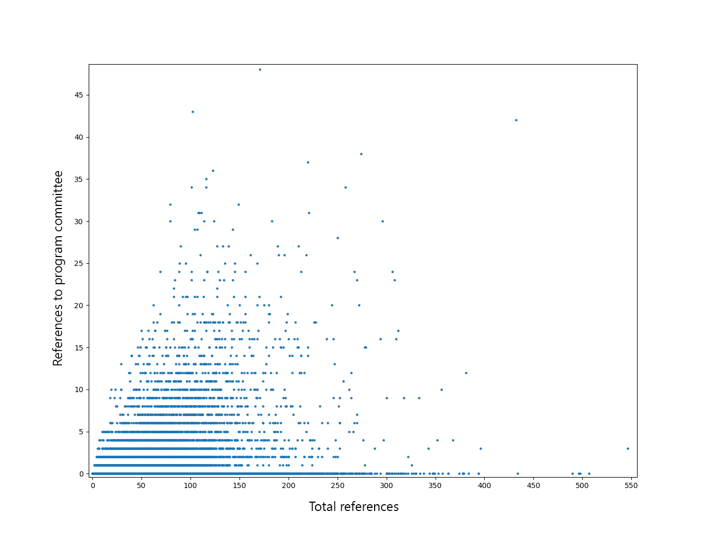
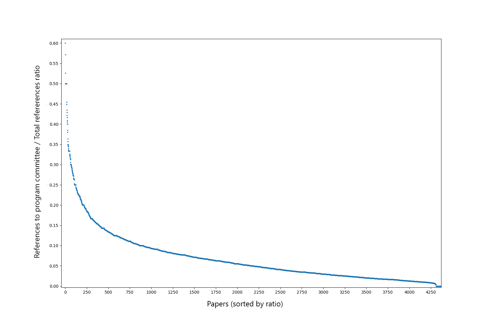

# CBAT: Committee Bias Analysis Tool
Project developed for the Bachelor's degree thesis titled "Tool to search for a systemic bias in bibliography linked to the composition of the program committee of scientific conferences".

## Abstract
The peer review process of research articles is a key part of academic publishing; its abuse for the purpose of personal return may affect the admission of the papers presented at scientific conferences. The aim of this thesis is the construction of a tool for the collection of bibliometric data useful for analysis aimed at finding systemic bias due to the composition of the scientific conference commission. The proposed implementation uses advanced Natural Language Processing (NLP) techniques for extrapolation of information and recognition of the entities present in the Call For Papers of major international academic events.

### Examples
Running the software on 50 of the best II-GRIN-SCIE Conference Rating 2017 conferences, the software has processed 110 different editions. From these have been extracted 222.648 authors, more than 988 members of program committees, and 11.626 papers in which have been discovered 892.650 references to authors. Of these, 20.402 are references to a program committee member. This averages to:
* 2 editions per conference extracted with success
* 9 program committee members per event
* 105 papers per conference
* 77 references per paper
* 2 references to a program committee member per paper

Plotting the refs gives the following two results:

|  |  |
|------|------|
|   Distribution of references to program committee members in relation to total references in papers   |     Papers sorted by the ratio between references to program committee members on total references |


---

## Installation

### Python
This project requires Python 3.7. It does NOT support Python 3.8 due to a compatibility issue of the Spacy dependency ([Github issue here](https://github.com/explosion/spaCy/issues/4581))

1. Install Python 3.7 (follow [this guide](https://www.freecodecamp.org/news/installing-multiple-python-versions-on-windows-using-virtualenv/) for installing multiple python versions)
1. Install virtualenv
    ```
    pip install virtualenv
    ```
1. Create a virtualenv
    ```
    virtualenv env -p C:\Users\<YOUR_USER>\AppData\Local\Programs\Python\Python37\python.exe
    ```
1. Activate the virtualenv
    ```
    .\env\Scripts\activate.bat
    ```


### Dependencies
1. Install project requirements
    ```
    pip install -r requirements.txt
    ```
1. Install MongoDB
1. After installing the project requirements you must configure Scopus providing a [valid API key](https://dev.elsevier.com/apikey/manage) (following the [official guide](https://pybliometrics.readthedocs.io/en/stable/configuration.html)). Most likely like this:
    ```
    python
    >> import pybliometrics
    >> pybliometrics.scopus.utils.create_config()
    ```

## Configuration
Project configurations can be found in the file `config.py`.
| **Variable**                | **Default value**          | **Description**                                                                                                                                                                                                                                                                                                                                                                                              |
| :--------------------------- | :----------------------------- | :-------------------------------------------------------------------------------------------------------------------------------------------------------------------------------------------------------------------------------------------------------------------------------------------------------------------------------------------------------------------------------------------------------- |
| HEADINGS                     | ["committee "commission"]      | Keywords used to recognize begin and end of conference committee's sections                                                                                                                                                                                                                                                                                      |
| PROGRAM\_HEADINGS             | ["program "programme "review"] | Keywords used to recognize free text sections that include the program committee                                                                                                                                                                                                                                                              |
| CONF\_EDITIONS\_LOWER\_BOUNDARY | 5                              | Number of years before the current for which to search conferences editions                                                                                                                                                                                                                                                                                          |
| CONF\_EXCLUDE\_CURR\_YEAR       | True                           | Indicates whether to exclude the current year from the search fo conferences editions                                                                                                                                                                                                                                                                                        |
| AUTH\_NO\_AFFILIATION\_RATIO    | 0\.5                           | After the program committee extraction, if the ratio between authors for which it was not possible to extract the affiliation and the total authors is greater than this threshold, the conference will be discarded                                                                                                                               |
| AUTH\_NOT\_EXACT\_RATIO         | 0\.5                           | During the program committee extraction, if the ratio between the people that have not been recognized as such by NLP and the total extracted people is greater that this threshold, we can then infer that the section probably contains not only author names and affiliations, but also other text. Therefore, in the extraction result we will only consider the people extracted precisely.
| MIN\_COMMITTEE\_SIZE           | 5                              | If the program committee extraction returns a number of authors less than this threshold, the extraction probably was not executed with success. Therefore, the conference will be discarded.                                                                                                                                                                             |
| NER\_LOSS\_THRESHOLD           | 0\.7                           | Threshold after which we can infer that the NER has lost a significative quantity of data in the program committee extraction (closer to 1: allows no flexibility in the CFP names list pattern)                                                                                                                                                                                                                        |
| FUZZ\_THRESHOLD               | 70                             | Threshold after which we consider the accuracy of the author's affiliation extraction not sufficient                                                                                                                                                                                                                                             |
| SPACY\_MODEL                  | 'en\_core\_web\_sm'               | Trained neural network model that SpaCy will use in NER                                                                                                                                                                                                                                                                                                                         |
| DB\_NAME                      | ‘cbat’                         | Name of the MongoDB database. In case it doesn't exist it will be automatically generated.                                                                                                                                                                                                                                     |
| WIKICFP\_BASE\_URL             | 'http://www.wikicfp.com'       | Base URL of WikiCFP website                                                                                                                                                                                                                                                                                                                                                                              |
---
## Using the project
You can use the project programmatically as follows:

```python
import cbat
from cbat.models import Conference

if __name__ == "__main__":
    conf = Conference(name="Conference on Applications, Technologies, Architectures, and Protocols for Computer Communication", acronym="SIGCOMM")
    cbat.add_conference(conf)
    corr_coeff = cbat.plot_refs()
```

This code will add the conference "SIGCOMM" to the database, and then draw the statistics plots.

## Functions
* `add_conference(Conference)`: add a single conference to the db. Note that the argument has to be a `cbat.models.Conference` object

* `add_conference(Conferences[])`: add multiple conferences to the db. Note that the argument has to be an array of `cbat.models.Conference` objects

* `add_authors_stats(authors[]=None)`: add some stats to the authors provided as argument, or to all the authors in the db otherwise. Stats added are:
    * references to program committee / total references ratio
    * references not to program committee / total references ratio

* `plot_refs()`: draws two plots:
    * References to program committee on Total references
    * References to program committee / Total references ratio on Papers (sorted by ratio)

----

## Issues and questions
Please open an issue on Github or reach out to me directly.
